# 📍 Maply — Aplicación de Ubicación en iOS (SwiftUI)

## 📱 Descripción del proyecto

**Maply** es una aplicación móvil desarrollada en **SwiftUI** que permite al usuario:

- visualizar su ubicación en tiempo real
- guardar ubicaciones personalizadas
- consultar un listado de ubicaciones guardadas
- ver detalles de cada ubicación en mapa
- gestionar preferencias del usuario
- recibir notificaciones locales al guardar ubicaciones

El proyecto implementa el caso de uso **Tracking / Ubicación**, integrando mapas, persistencia local y consumo de API externa.

---

## 🎯 Objetivo

Desarrollar una aplicación funcional en iOS que demuestre:

- uso de SwiftUI
- integración con APIs externas
- manejo de persistencia local
- uso de capacidades del dispositivo (ubicación y notificaciones)
- navegación entre múltiples pantallas
- manejo de estado y arquitectura limpia

---

## 🧩 Funcionalidades principales

### 🗺️ Mapa y ubicación
- Visualización de la ubicación actual del usuario
- Botón para centrar mapa en ubicación actual
- Manejo de permisos de ubicación

### 📍 Guardado de ubicaciones
- Guardar ubicación actual
- Autocompletado de dirección con Geoapify (Reverse Geocoding)
- Búsqueda de direcciones con sugerencias (Autocomplete)
- Persistencia con SwiftData

### 📋 Listado de ubicaciones
- Visualización de ubicaciones guardadas
- Filtros por tipo (azul, verde, teal)
- Eliminación con swipe
- Navegación a detalle

### 📄 Detalle de ubicación
- Vista detallada
- Mini mapa con marcador
- Información completa (nombre, dirección, coordenadas)

### 🔔 Notificaciones
- Activación/desactivación desde Settings
- Notificación local al guardar ubicación
- Manejo de permisos del sistema

### ⚙️ Configuración (Settings)
- Tema claro / oscuro / sistema
- Notificaciones
- Privacidad (estado de permisos)
- Ayuda y términos
- Cerrar sesión

### 🔐 Autenticación
- Login con email y contraseña
- Validación de campos
- Persistencia de sesión
- Almacenamiento seguro con Keychain

### 🌙 Dark Mode
- Soporte completo de modo oscuro
- Colores dinámicos desde Assets

---

## 🏗️ Arquitectura

El proyecto sigue una estructura modular basada en separación de responsabilidades:

- Maply/
    - App/
    - Views/
    - ViewModels/
    - Models/
    - Services/
    - Managers/
    - Config/
    - Utils/


### Componentes clave

- **ViewModels**
  - `AuthViewModel`
- **Managers**
  - `LocationManager`
  - `NotificationManager`
- **Services**
  - `GeoapifyGeocodingService`
- **Persistencia**
  - `SwiftData (SavedLocationItem)`
- **Configuración**
  - `AppColors`
  - `APIKeys`

---

## 🌐 Integración con API

Se integró la API de **Geoapify** para:

### 🔁 Reverse Geocoding
Convierte coordenadas → dirección legible

### 🔍 Autocomplete
Búsqueda de direcciones en tiempo real con sugerencias

---

## 💾 Persistencia de datos

- **SwiftData** para almacenamiento local de ubicaciones
- **Keychain** para persistencia segura de sesión

---

## 🔒 Seguridad

- Manejo seguro de credenciales
- Uso de Keychain
- Control de sesión
- Manejo de permisos del sistema:
  - Ubicación
  - Notificaciones

---

## 📲 Permisos utilizados

### 📍 Ubicación
- Obtener ubicación actual
- Centrar mapa

### 🔔 Notificaciones
- Mostrar notificación al guardar ubicación

---

## 🎨 Diseño

- Interfaz moderna con SwiftUI
- Componentes reutilizables
- Custom TabBar
- Popups personalizados
- Dark Mode completo

---

## 🚀 Instalación y ejecución

### Requisitos

- Xcode 15+
- iOS 17+
- Swift 5+

### Pasos

1. Clonar el repositorio:

```bash
git clone https://github.com/Wilprojects/Maply.git
```

2. Abrir el proyecto en Xcode:

```bash
Maply.xcodeproj
```

3. Configurar API Key:
Editar:

```bash
Config/APIKeys.swift
static let geoapify = "3e1dc93ad20d4df7bffd00c34f59c961"
```

4. Ejecutar en simulador:

```bash
Cmd + R
```

---

## 🧪 Pruebas recomendadas

- Login correcto e incorrecto
- Guardar ubicación
- Autocompletado de direcciones
- Filtros en listado
- Eliminación de ubicaciones
- Notificaciones
- Cambio de tema
- Permisos denegados

---

## 📸 Capturas de Pantalla del Aplicativo

- Pantalla principal (Mapa)
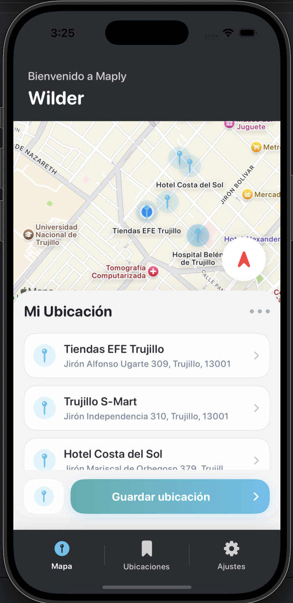
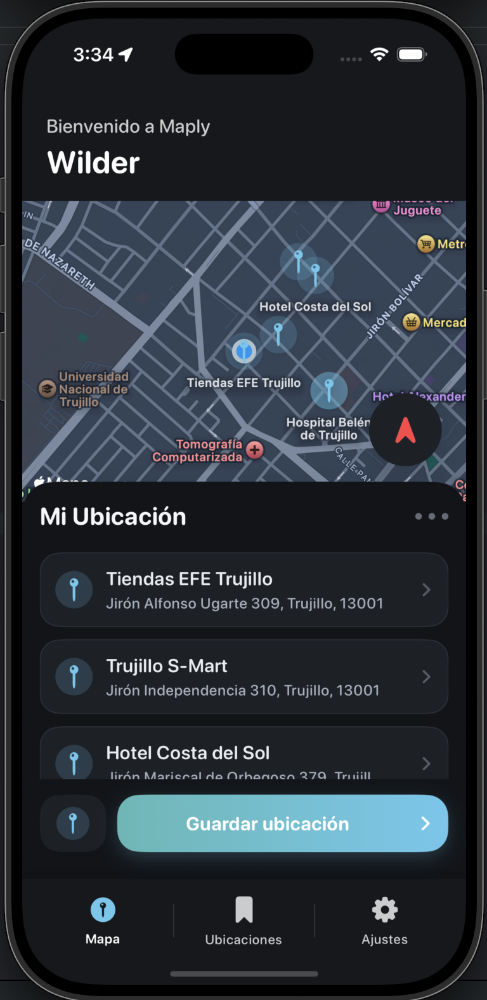

- Lista de ubicaciones
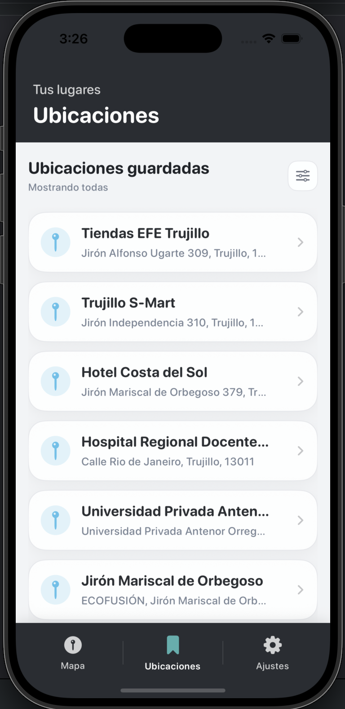
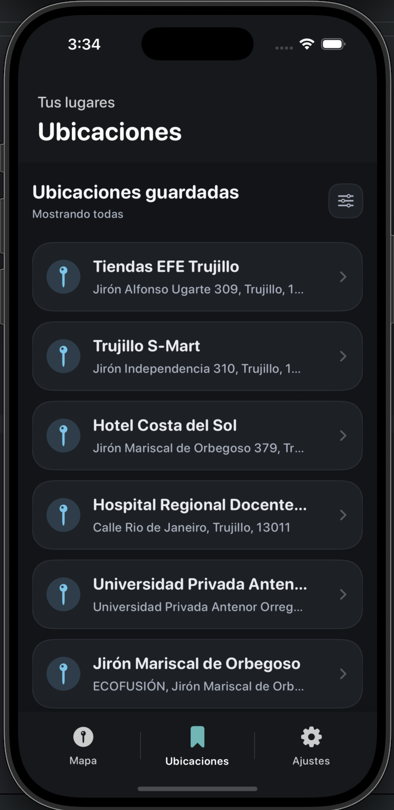

- Detalle de Ubicaciones
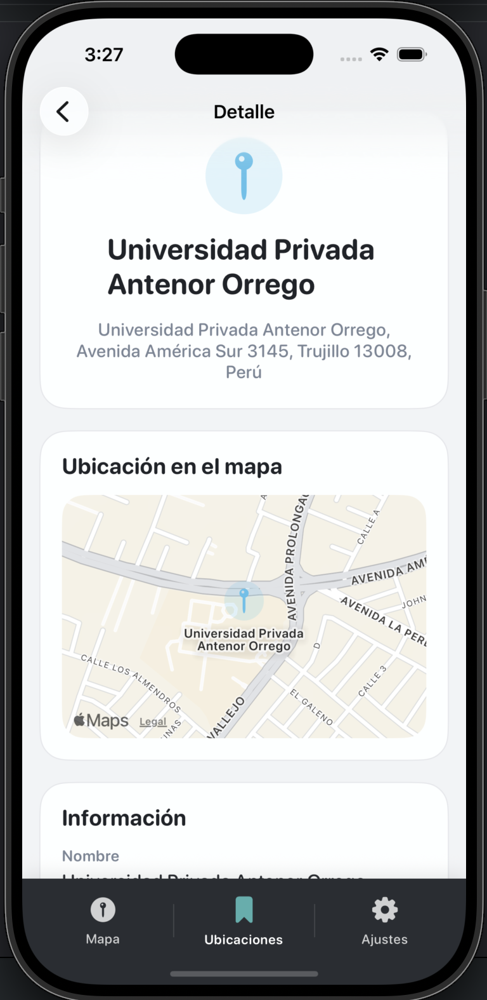
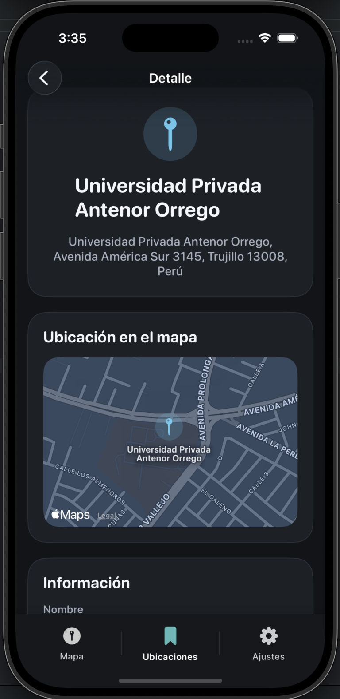

- Settings
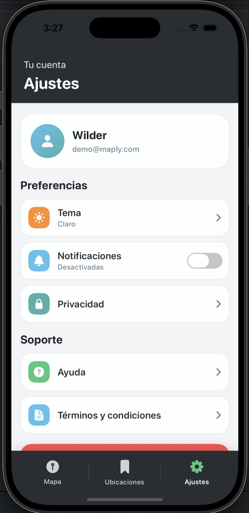
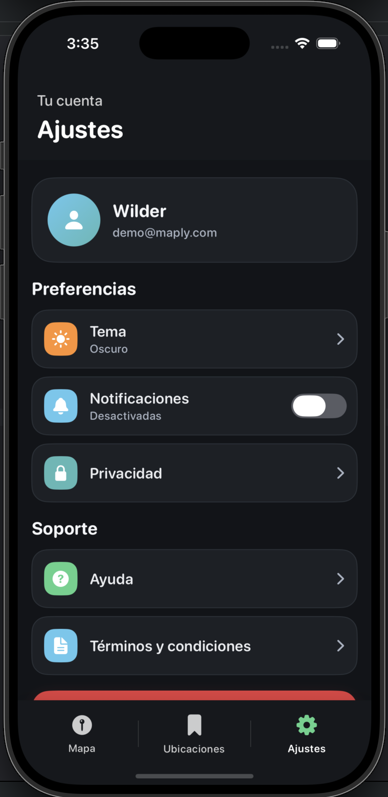

- Popup de guardar ubicación
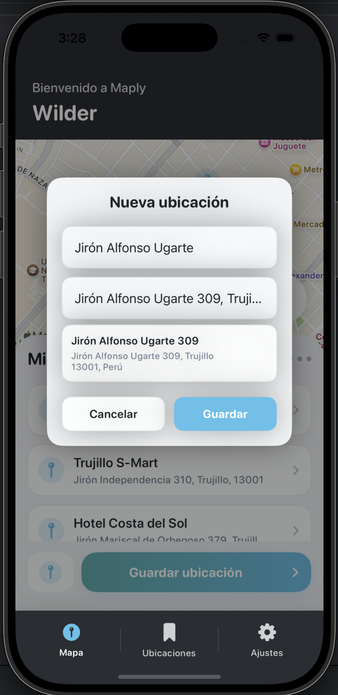
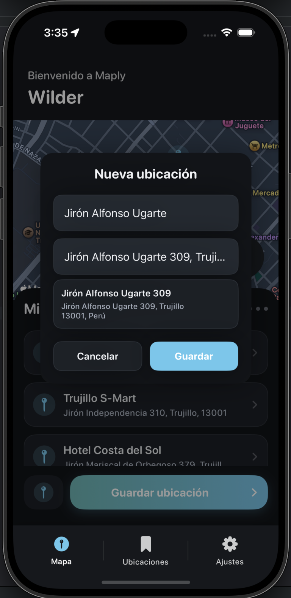

- Privacidad (Permisos de Ubicacion)
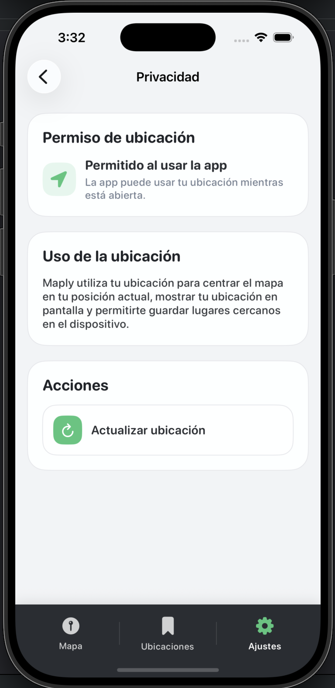
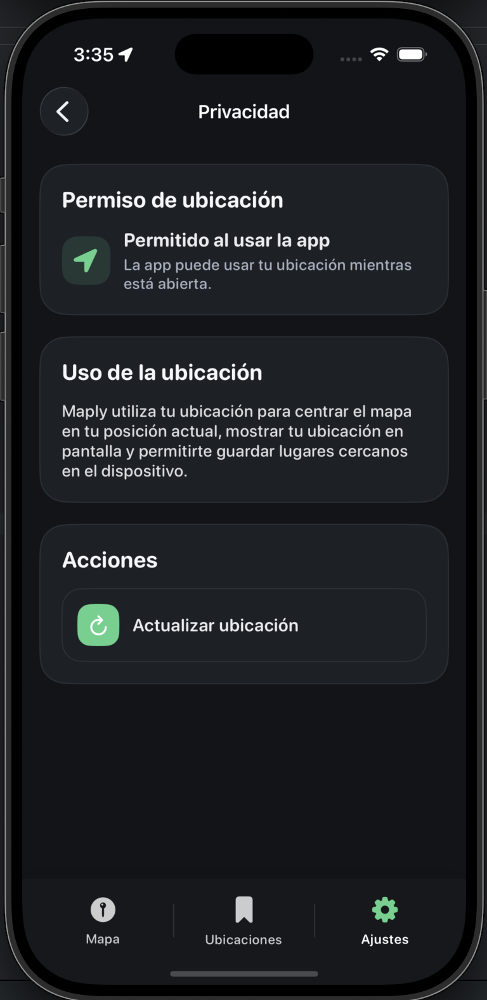

---

## 📌 Tecnologías utilizadas

- SwiftUI
- MapKit
- SwiftData
- UserNotifications
- CoreLocation
- Keychain
- Geoapify API

---

## 📈 Posibles mejoras

- Integración con backend (Firebase / API propia)
- Sincronización en la nube
- Edición de ubicaciones
- Búsqueda avanzada en mapa
- Tests unitarios
- Accesibilidad (VoiceOver)
- Soporte offline

---

## 👨‍💻 Autor
Wilder Moreno Zavaleta

---

## 📝 Licencia
Proyecto académico con fines educativos.

---
